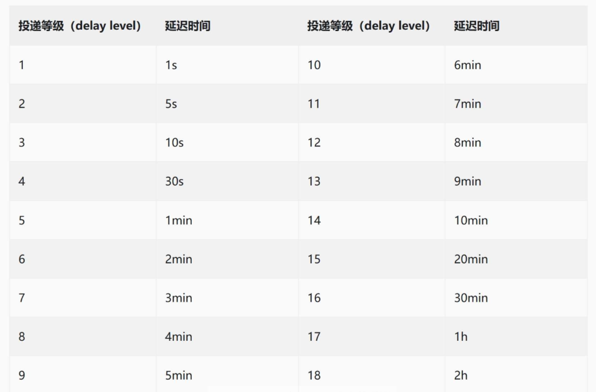

+++
date = '2025-12-22T13:52:39+08:00'
draft = true
title = 'Spring Boot 3.x 整合RocketMQ'
+++

## 1、添加依赖
```xml
 <!-- Rocket MQ -->
  <rocketmq.version>2.2.3</rocketmq.version>

<dependency>
    <groupId>org.apache.rocketmq</groupId>
    <artifactId>rocketmq-spring-boot-starter</artifactId>
    <version>${rocketmq.version}</version>
</dependency>
```
## 2、配置
``` yml
rocketmq:
  name-server: 127.0.0.1:9876 # name server 地址
  producer:
    group: xfff_group
    send-message-timeout: 3000 # 消息发送超时时间，默认 3s
    retry-times-when-send-failed: 3 # 同步发送消息失败后，重试的次数
    retry-times-when-send-async-failed: 3 # 异步发送消息失败后，重试的次数
    max-message-size: 4096 # 消息最大大小（单位：字节）
  consumer:
    group: xfff_group
    pull-batch-size: 5 # 每次拉取的最大消息数
```
## 3、引入 RocketMQConfig类
由于 rocketmq-spring-boot-starter 本身是基于 Spring Boot 2.x 开发的，2.x和 3.x 在定义 starter 时的格式是有区别的，存在兼容性问题。为了能够在 Spring Boot 3.x 中使用它，需要在 /config 包下，创建一个 RocketMQConfig 配置类，并添加 @Import(RocketMQAutoConfiguration.class) , 手动引入一下自动配置类：
```java
import org.apache.rocketmq.spring.autoconfigure.RocketMQAutoConfiguration;
import org.springframework.context.annotation.Configuration;
import org.springframework.context.annotation.Import;

@Configuration
@Import(RocketMQAutoConfiguration.class)
public class RocketMQConfig {
}
```

## 4、生产者

```java
 // 同步发送广播模式 MQ，将所有实例中的本地缓存都删除掉
rocketMQTemplate.syncSend(MQConstants.TOPIC_DELETE_NOTE_LOCAL_CACHE, noteId);
```

## 5、消费者

```java
import lombok.extern.slf4j.Slf4j;
import org.apache.rocketmq.spring.annotation.MessageModel;
import org.apache.rocketmq.spring.annotation.RocketMQMessageListener;
import org.apache.rocketmq.spring.core.RocketMQListener;
import org.springframework.stereotype.Component;

@Component
@Slf4j
@RocketMQMessageListener(consumerGroup = "xfff_group", // Group
        topic = MQConstants.TOPIC_DELETE_NOTE_LOCAL_CACHE, // 消费的主题 Topic
        messageModel = MessageModel.BROADCASTING) // 广播模式
public class DeleteNoteLocalCacheConsumer implements RocketMQListener<String>  {

    @Override
    public void onMessage(String body) {
        Long noteId = Long.valueOf(body);
        log.info("## 消费者消费成功, noteId: {}", noteId);
    }
    
}
```

## 如何实现延迟消息的处理

生产者
```java
// 一致性保证：延迟双删策略
// 异步发送延时消息
Message<String> message = MessageBuilder.withPayload(String.valueOf(noteId))
    .build();

rocketMQTemplate.asyncSend(MQConstants.TOPIC_DELAY_DELETE_NOTE_REDIS_CACHE, message,
    new SendCallback() {
        @Override
        public void onSuccess(SendResult sendResult) {
            log.info("## 延时删除 Redis 笔记缓存消息发送成功...");
        }

        @Override
        public void onException(Throwable e) {
            log.error("## 延时删除 Redis 笔记缓存消息发送失败...", e);
        }
    },
    3000, // 超时时间(毫秒)
    1 // 延迟级别，1 表示延时 1s
);
```
延迟级别


消费者
```java
@Component
@Slf4j
@RocketMQMessageListener(consumerGroup = "xfff_group_" + MQConstants.TOPIC_DELAY_DELETE_NOTE_REDIS_CACHE, // Group
        topic = MQConstants.TOPIC_DELAY_DELETE_NOTE_REDIS_CACHE // 消费的主题 Topic
        )
public class DelayDeleteNoteRedisCacheConsumer implements RocketMQListener<String>  {

    @Override
    public void onMessage(String body) {
        Long noteId = Long.valueOf(body);
        log.info("## 延迟消息消费成功, noteId: {}", noteId);
    }
}
```


三、文档处理与存储规范  
                                                                                                                                                                             

                      3.1    文档切分规则                                                                                                                                                                             

                      所有上传到知识库的文档，必须遵循以下切分规则：


