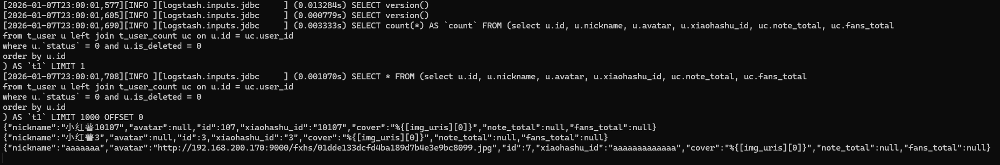

+++
date = '2026-01-07T11:38:20+08:00'
draft = true
title = '全量 Es 索引构建：使用 Logstash Input Jdbc 插件'
tags = ['Elasticsearch']
categories = ['中间件']
image = "images/postCover/es.png"
+++

## 什么是全量索引构建?

全量索引构建是指在 Elasticsearch 搜索引擎中，重新创建整个索引的过程。这个过程涉及到将所有数据从源（如数据库）读取, 并重新索引到 Elasticsearch 中。全量索引构建通常用于以下几种情况：

1. 初次建立索引：当第一次为一个新应用或系统创建搜索功能时，需要进行一次全量索引构建来初始化索引。
2. 数据迁移：当你更换了数据存储解决方案或者调整了数据模型之后，可能需要重新构建索引来确保新的结构能够正确地被索引和搜索。
3. 定期维护：为了保持索引的健康状态，有时会定期执行全量重建，以解决索引碎片化问题或是更新索引配置。
4. 数据恢复：在某些情况下，如果现有索引遇到严重错误或丢失，可能需要通过全量重建的方式来恢复数据。
5. 大规模数据更新：当对大量文档进行了修改，并且这些修改难以通过增量更新有效处理时，可能会选择执行全量索引构建。

## 下载与安装 Logstash

访问 Logstash 官网历史版本下载链接：https://www.elastic.co/downloads/past-releases

## 安装 logstash-input-jdbc

>  logstash-input-jdbc 是 **Logstash** 的一个插件，它允许用户通过 JDBC (Java Database Connectivity) 从关系型数据库中读取数据，并将这些数据作为事件输入到 Logstash 中。这个插件非常适合用于从数据库中提取日志信息、监控数据或其他类型的数据，并将其导入到 Elasticsearch 或其他目标系统中进行进一步处理或分析。

打开命令行工具，执行 cd 命令，进入到 Logstash 安装目录的 /bin 文件夹下：
接着，执行如下命令来安装 logstash-input-jdbc 插件：
```bash
.\logstash-plugin install logstash-input-jdbc
```

## 创建配置文件
①：新建一个 /mysql 文件夹；
②：小哈书项目中，我们使用的是 mysql 8.x 的驱动，进入本地 maven 仓库，复制一个 8.x 的驱动 Jar 包到 /mysql 文件夹下，我这里使用的是 8.0.32 版本；
③：再新建一个 /sync-es-note-index 文件夹，用于放置同步索引需要的配置文件；


进入到 /sync-es-note-index 文件夹中，分别创建两个配置文件：
* jdbc.conf : 核心配置文件，如读取哪个数据源，中间如何处理，同步到哪个目标数据源；
* jdbc.sql : 编写查询数据库的 SQL 脚本；

```conf
input { # 输入
  jdbc {
    jdbc_driver_library => "D:\logstash-7.3.0\config\mysql\mysql-connector-java-8.0.30.jar"  # MySQL JDBC 驱动路径
    jdbc_driver_class => "com.mysql.cj.jdbc.Driver"  # MySQL JDBC 驱动类
    jdbc_connection_string => "jdbc:mysql://localhost:3306/fxiaohongshu"  # MySQL 链接
    jdbc_user => "root"  # MySQL 用户名
    jdbc_password => "123456"  # MySQL 密码
    jdbc_paging_enabled => "true" # 开启分页，分批次查询
    jdbc_page_size => "1000" # 每批查询 1000 条

    # 查询 SQL 脚本路径（从数据库提取数据）
    statement_filepath => "D:\logstash-7.3.0\config\mysql\sync-es-note-index\jdbc.sql"

    # 任务调度频率
    schedule => "* * * * *"  # 每分钟执行一次查询
  }
}

filter {
  # 如果需要进一步处理数据，可以在这里添加其他过滤器

  mutate { # mutate 提供了多种功能来处理和转换字段值
    split => ["img_uris", ","] # 分隔 img_uris 字段为数组
    add_field => { "cover" => "%{[img_uris][0]}" } # 添加一个 cover 字段，并将 img_uris 数组中第一个 url 设置为其值
    remove_field => ["img_uris"]  # 移除 img_uris 字段
    remove_field => ["@timestamp"] # 移除 @timestamp 字段
    remove_field => ["@version"] # 移除 @version 字段
  }
}

output { # 输出
  elasticsearch { # Elasticsearch 配置
    hosts => ["http://192.168.200.170:9200"] # Elasticsearch 链接
    index => "note"  # Elasticsearch 索引名称
    document_id => "%{id}"  # 使用查询结果中的 id 字段，作为文档的唯一标识
  }

  stdout {
    codec => json_lines  # 打印日志输出到控制台，便于调试
  }
}
```
sql
注意：查询字段名需要和 es 索引中的字段名保持一致，才能对应的上，不一致可通过 as 来重命名。
```sql
select n.id, n.title, n.topic_name as topic, n.type, n.img_uris, 
DATE_FORMAT(n.create_time, '%Y-%m-%d %H:%i:%s') AS create_time,
DATE_FORMAT(n.update_time, '%Y-%m-%d %H:%i:%s') AS update_time,
u.nickname, u.avatar, nc.like_total, nc.collect_total, nc.comment_total
from t_note n left join t_user u on n.creator_id = u.id
left join t_note_count nc on n.id = nc.note_id 
where n.visible = 0 and n.`status` = 1 
order by n.id
```

## 启动调度任务
打开命令行，进入到 Logstash 安装目录的 /bin 文件夹下，执行如下命令，开始全量同步笔记索引：
```bash
.\logstash -f ..\config\mysql\sync-es-note-index\jdbc.conf
```


